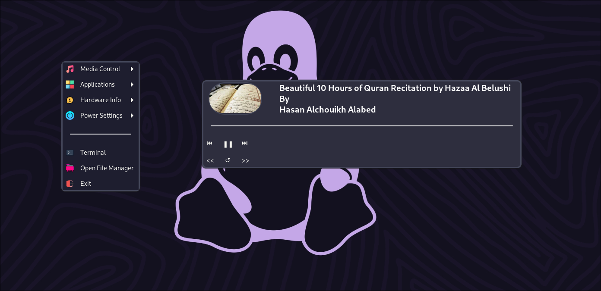
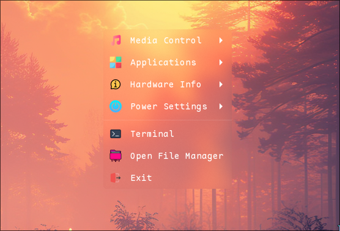
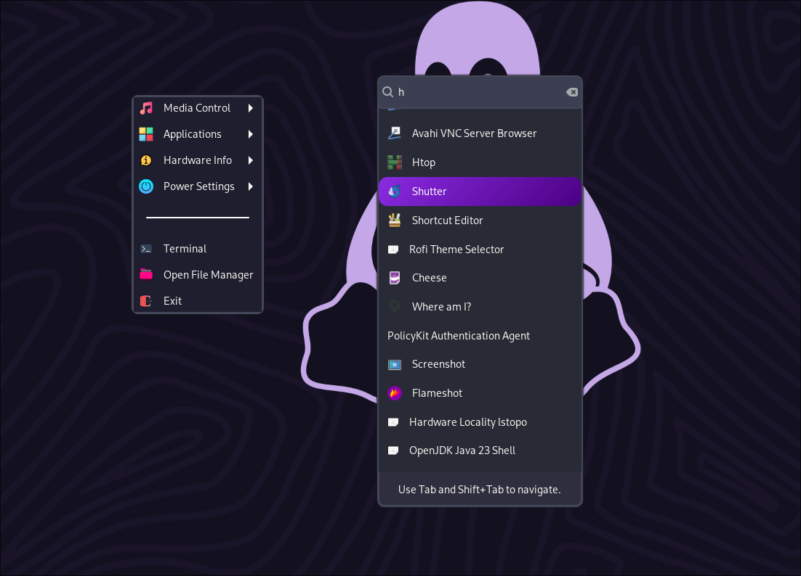
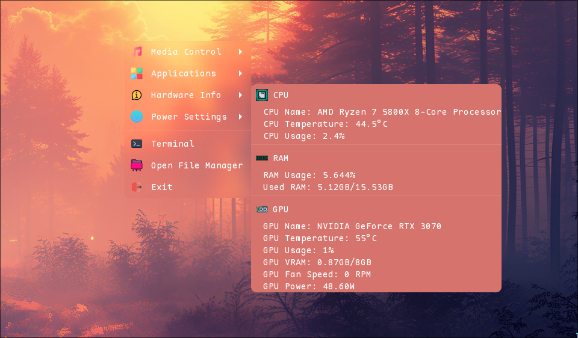
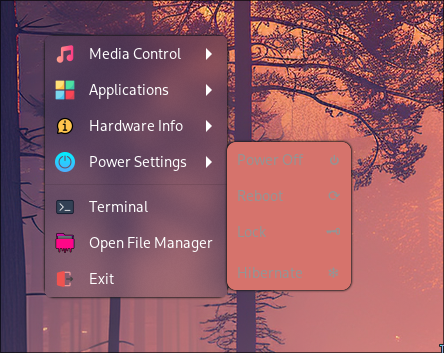

# 💊 Capsule

> 

**Capsule** is a modern, customizable system panel built for Linux using Python, GTK and D-Bus. It provides essential system info, media control, and more — all in a clean, responsive UI.

---

## ✨ Features

- 🚀 **Application launcher**: shows all the application that are installed on your system which you can launch
- ⚡ **Power Options**: Lock, reboot, shutdown, or hibernate
- 🎵 **Media Controls**:
  - Displays the current playing media title
  - Click to reveal title, artist, album art, and control buttons (play/pause, forward, backward, reset)
  - Thumbnail image auto-updates and appears as a rounded preview
- 🖥️  **Hardware Info**: shows CPU, GPU and RAM usages temps, names, etc
- 💻 **Terminal**: Lauch your favorite terminal emulator
- 📂 **File Manager**: Lauch your favorite file manager
- 🎨 **Custom Styling**: Easily modify the look and feel via `config/style.css`
---


## 📸 Screenshots

>     

---

## 🛠️ Built With

- **Python 3**
- **GTK** – For GUI components
- **D-Bus** – For Media title and Thumbnail

---


## 📦 Installation

make sure these packages are installed on your system
`sudo pacman -S python-gobject gtk3 playerctl hyprlock`
and
`pip install pyGObject pycairo dbus-python configparser`

1. **Clone the repo**
   ```bash
   git clone https://github.com/NaturalCapsule/capsule
   ```

2. **Goto directory**
   ```bash
   cd capsule
   ```

3. **Launch**

   ```bash
   GDK_BACKEND=wayland python app.py
   ```

4. **Enjoy!**
